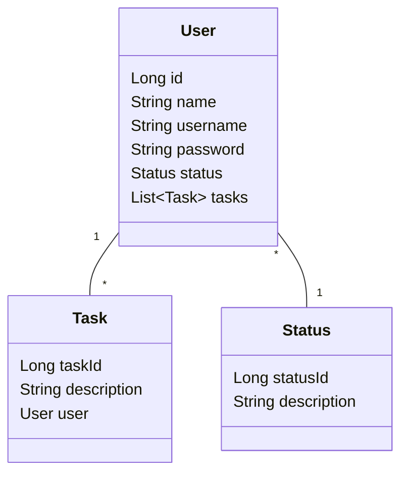

# Trilha Back end Jr - Código certo

---

## Desenvolvimento de Sistema de Gerenciamento de Tarefas com Controle de Acesso

Com base na proposta do desafio, optei por desenvolver uma solução simples, mas com um nível de complexidade interessante. 
Assim, criei um sistema de gerenciamento de tarefas baseado em uma lista de afazeres (TODO list). Cada usuário terá acesso 
exclusivamente às tarefas que criar, garantindo que um usuário não possa visualizar ou modificar as tarefas de outro.

#### Segue links para teste e visualização

- Swagger: -link aq-
- Collection: -link aq-
- Url deploy: -link aq-

---

### Escolha de Tecnologia e Arquitetura

Neste desafio de projeto, optei por utilizar Java com Spring devido ao meu maior conhecimento e conforto com essa linguagem.

#### Motivação para Java com Spring

- **Familiaridade:** Java é a linguagem na qual tenho mais conhecimento e experiência, permitindo-me desenvolver com
maior eficiência e segurança.
- **Framework Spring:** O Spring oferece uma vasta gama de funcionalidades que facilitam o desenvolvimento de 
aplicações robustas e escaláveis.

#### Arquitetura Utilizada

Decidi utilizar a arquitetura MVC (Model, View, Controller) por suas vantagens em termos de organização e simplicidade. Embora o projeto não seja muito complexo, a arquitetura MVC mantém o código:

- **Clean:** Facilita a manutenção e a compreensão do código.
- **Modular:** Separa claramente as responsabilidades, melhorando a estrutura e a extensibilidade do projeto.
- **Facilidade de Entendimento:** A sepa

---

### Diagrama UML de Relacionamento de Entidades



---

### Escolha do Banco de dados

Optei por utilizar o MySQL como banco de dados em vez do SQLite. 
Esta decisão foi tomada porque pretendo implementar um relacionamento entre tarefas (tasks) e usuários (users), 
onde cada usuário terá controle de suas próprias tarefas sem interferir nas tarefas de outros usuários.

#### Motivação para o MySQL

- **Relacionamentos:** MySQL oferece um suporte robusto para a criação e manutenção de relacionamentos entre tabelas,
algo essencial para gerenciar as associações entre tarefas e usuários de forma eficiente.
- **Escalabilidade:** MySQL é mais adequado para projetos que podem crescer em complexidade e volume de dados,
proporcionando uma escalabilidade que o SQLite não oferece tão bem.
- **Desempenho:** Para operações mais complexas e consultas em grandes volumes de dados, o MySQL geralmente oferece um 
desempenho melhor em comparação com o SQLite.

#### Utilização do Docker Compose

Para evitar a necessidade de instalar o MySQL diretamente no meu computador, utilizei o Docker Compose para criar e 
gerenciar um contêiner com a imagem do MySQL. Isso oferece diversas vantagens:

- **Isolamento:** O banco de dados roda em um ambiente isolado, evitando conflitos com outros serviços ou configurações
no sistema host.
- **Portabilidade:** É fácil replicar o ambiente de desenvolvimento em outras máquinas ou servidores.
- **Facilidade de Configuração:** O Docker Compose permite definir todas as configurações do contêiner em um único 
arquivo `docker-compose.yml`, facilitando a criação e a manutenção do ambiente de desenvolvimento.

---

### Dependencias

Deixarei listado todas as dependencias usadas nesse projeto e uma breve descrição de cada.

- **Spring Web:** Utilizada para criar e configurar aplicações web, utilizando o servidor embutido Tomcat;
- **Spring JPA:** Utilizada para a integração e manipulação de banco de dados através da especificação Java Persistence
API, facilitando o mapeamento objeto-relacional (ORM);
- **Spring Security:** Utilizada para adicionar camadas de segurança à aplicação, fornecendo autenticação e autorização
robustas;
- **JWT (JSON Web Token):** Utilizada para a implementação de autenticação baseada em token. JWTs permitem a 
transmissão segura de informações entre partes como um objeto JSON, garantindo a integridade e autenticidade dos
dados transmitidos;
- **Driver do MySql:** Necessário para a conexão da aplicação com um banco de dados MySQL; 
- **Driver do H2:** Utilizei o h2 (banco em nuvem) para fazer os testes unitários;
- **Starter Test:** Dependencia padrão de testes que vem com o Spring web, implementa JUnit5 e Mockito.

---

### Passo a Passo para Subir o Projeto Localmente

Caso opte por subir o projeto localmente em vez de apenas testar pelo Swagger, você precisará ter o Docker e a JDK 
instalados em seu computador, além do Postman ou Insomnia para testar as requisições.

#### 1. Abra seu terminal e faça o clone do projeto

```
git clone https://github.com/Navarriin/TrilhaBackEndJR-JUN15.git
```

#### 2. Com o Docker iniciado em seu PC, entre na pasta docker

```
cd TrilhaBackEndJR-JUN15/docker
```
#### 3. Suba a imagem do Docker

```
docker compose up
```

Com os passos anteriores, você já pode abrir e iniciar o projeto em sua IDE de preferência.

Agora abra seu Postman ou Insomnia e importe a Collection que deixarei disponível para você fazer seus testes.