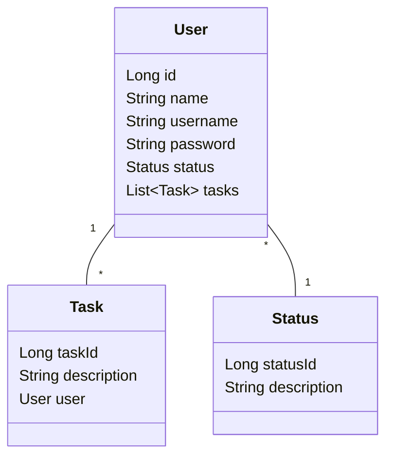

# Trilha Back end Jr - Código certo

---

## Desenvolvimento de Sistema de Gerenciamento de Tarefas com Controle de Acesso

Com base na proposta do desafio, optei por desenvolver uma solução simples, mas com um nível de complexidade interessante. 
Assim, criei um sistema de gerenciamento de tarefas baseado em uma lista de afazeres (TODO list). Cada usuário terá acesso 
exclusivamente às tarefas que criar, garantindo que um usuário não possa visualizar ou modificar as tarefas de outro.

#### Segue links para teste e visualização

- Swagger: [Clique para abrir](https://editor.swagger.io/?_gl=1*1i4izy5*_gcl_au*MTAyNTI0OTAzOS4xNzE3MDQwNjg1&_ga=2.150547574.178939595.1720296402-1463679959.1717040677)
- Collection: [Clique para fazer download](https://drive.google.com/uc?export=download&id=1bsVf4hcFoRnTFmH0bkQ1_3pxa1Koit7g)
- Url deploy: https://trilhabackendjr-jun15-nh4m.onrender.com

---

### Escolha de Tecnologia e Arquitetura

Neste desafio de projeto, optei por utilizar Java com Spring devido ao meu maior conhecimento e conforto com essa linguagem.

#### Motivação para Java com Spring

- **Familiaridade:** Java é a linguagem na qual tenho mais conhecimento e experiência, permitindo-me desenvolver com
maior eficiência e segurança.
- **Framework Spring:** O Spring oferece uma vasta gama de funcionalidades que facilitam o desenvolvimento de 
aplicações robustas e escaláveis.

#### Arquitetura Utilizada

Decidi utilizar a arquitetura MVC (Model, View, Controller) por suas vantagens em termos de organização e simplicidade.
Embora o projeto não seja muito complexo, a arquitetura MVC mantém o código:

- **Clean:** Facilita a manutenção e a compreensão do código.
- **Modular:** Separa claramente as responsabilidades, melhorando a estrutura e a extensibilidade do projeto.

---

### Diagrama UML de Relacionamento de Entidades



---

### Escolha do Banco de dados

Optei por utilizar o H2 como banco de dados em vez do SQLite. 
Esta decisão foi tomada pois utilizando o H2, eu consigo utilizar o JPA do spring, deixando o código bem mais clean e 
menos propício a bugs.

---

### Dependencias

Deixarei listado todas as dependencias usadas nesse projeto e uma breve descrição de cada.

- **Spring Web:** Utilizada para criar e configurar aplicações web, utilizando o servidor embutido Tomcat;
- **Spring JPA:** Utilizada para a integração e manipulação de banco de dados através da especificação Java Persistence
API, facilitando o mapeamento objeto-relacional (ORM);
- **Spring Security:** Utilizada para adicionar camadas de segurança à aplicação, fornecendo autenticação e autorização
robustas;
- **JWT (JSON Web Token):** Utilizada para a implementação de autenticação baseada em token. JWTs permitem a 
transmissão segura de informações entre partes como um objeto JSON, garantindo a integridade e autenticidade dos
dados transmitidos;
- **Driver do H2:**  Necessário para a conexão da aplicação com um banco de dados h2 (banco em nuvem);
- **Starter Test:** Dependencia padrão de testes que vem com o Spring web, implementa JUnit5 e Mockito.

---

### Passo a Passo para testar o projeto usando o link

#### 1. Baixe a collection clicando neste link

- https://drive.google.com/uc?export=download&id=1bsVf4hcFoRnTFmH0bkQ1_3pxa1Koit7g

#### 2. Importe ela em seu Postman ou Insomnia e estará pronto para os testes.

- Postman: https://www.postman.com/
- Insomnia: https://insomnia.rest/download

---

### Passo a Passo para Subir o Projeto Localmente

Caso opte por subir o projeto localmente em vez de apenas testar pelo [Swagger](https://editor.swagger.io/?_gl=1*1i4izy5*_gcl_au*MTAyNTI0OTAzOS4xNzE3MDQwNjg1&_ga=2.150547574.178939595.1720296402-1463679959.1717040677), 
você precisará ter o [Docker](https://www.docker.com/get-started/) e a [JDK](https://www.oracle.com/java/technologies/javase/jdk17-archive-downloads.html) instalados em seu computador, 
além do [Postman](https://www.postman.com/) ou [Insomnia](https://insomnia.rest/download) para testar as requisições.

#### 1. Abra seu terminal e faça o clone do projeto

```
git clone https://github.com/Navarriin/TrilhaBackEndJR-JUN15.git
```
#### 2. Abra o projeto em sua IDE de preferencia
#### 3. Inicie o projeto (clicando na seta)

Seguindo os passos anteriores, seu projeto ja estará rodando.

Agora abra seu [Postman](https://www.postman.com/) ou [Insomnia](https://insomnia.rest/download) e importe a 
Collection que deixarei disponível para você fazer seus testes.